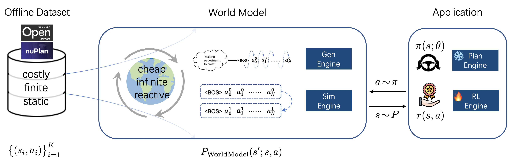
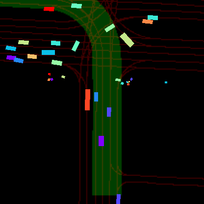
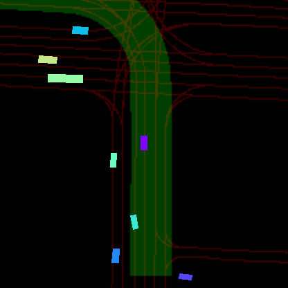

<div align="center">   
  
# Solving Motion Planning Tasks with a Scalable Generative Model 

**Accepted by ECCV 2024**

</div>

<h3 align="center">
  <a href="https://arxiv.org/abs/2407.02797">arXiv</a> 
</h3>

<div style="text-align:center">
  Yihan Hu, Siqi Chai, Zhening Yang, Jingyu Qian, Kun Li, Wenxin Shao, Haichao Zhang, Wei Xu, and Qiang Liu<br>
  Horizon Robotics
</div>


## Highlights <a name="high"></a>
🔥 GUMP revolutionizes autonomous driving simulation with a scalable and realistic approach to modeling driving scenes. Leveraging generative models, GUMP learns the dynamic interactions of traffic, enabling diverse future scenario simulations and the creation of new driving scenarios based on user prompts. This model operates efficiently in both full-Autoregressive and partial-Autoregressive modes, making it ideal for online reinforcement learning, planning policy evaluation, and high-fidelity testing. Explore our innovative framework that seamlessly integrates **data generation**, **realistic simulation**, **reactive planning**, and **online training**.



## Table of Contents:
1. [Highlights](#high)
2. [Getting Started](#start)
   - [Installation](docs/INSTALL.md)
   - [Prepare Dataset](docs/DATA_PREP.md)
   - [Evaluation Example](docs/TRAIN_EVAL.md#example)
   - [GPU Requirements](docs/TRAIN_EVAL.md#gpu)
   - [Train/Eval](docs/TRAIN_EVAL.md)
4. [Visualizations](#vis)
3. [Results and Models](#models)
4. [Release Roadmap](#todos)
5. [License](#license)
6. [Citation](#citation)


## Getting Started
- [Installation](docs/install.md)
- [Prepare Dataset](docs/prepare_dataset.md)
- [Train and Eval](docs/train_eval.md)


## Release Roadmap <a name="todos"></a>
Our release roadmap outlines the planned development and upcoming features:
### Version 1.0
- [x] Code initialization
- [x] Base-model configs & checkpoints
- [x] Downstream Task: Reactive Simulation
- [x] Evaluation Metrics
- [ ] Visualization

### Version 1.1
- [x] Reimplement with more efficient datastructure, ~4 times faster
- [x] Accelerate CPU code with Numba library
- [x] More advanced architecture, i.e Llama3
- [x] Downstream Task: Reactive Simulation
- [x] Evaluation Metrics
- [ ] Support the Waymo Dataset
- [ ] Downstream Task: Scenario Generation
- [ ] Downstream Task: Policy Enhancement
- [ ] Downstream Task: Reinforcement Learning
- [ ] Compatible with various tokenizers, including [Trajeglish](https://arxiv.org/abs/2312.04535) and [MotionLM](https://arxiv.org/abs/2309.16534).

### Future Versions
- [ ] [Long-term] End to end learning
- [ ] [Long-term] Alignment with agent behavior metrics

## Visualizations <a name="vis"></a>

| Task                | Description                                                                                                                 | Demo                                                                                                       |
| ------------------- | --------------------------------------------------------------------------------------------------------------------------- | ---------------------------------------------------------------------------------------------------------- |
| Scene Generation    | Scenes generated by GUMP on the nuPlan Dataset. Initial frames are autoregressively created based on the static map and scenario descriptions, followed by motion simulation through scene extrapolation. These scenes share the same map but have different scenario descriptions and various agents. |                      |
| Reactive Simulation | Showcasing diverse scenarios with Waymo Sim Agents, starting from the same conditions but diverging over time. Demonstrates GUMP's ability to simulate a rich, probabilistic range of future scenarios.  | [](https://storage.googleapis.com/93935945854-us-central1-blueprint-config/diverse_future.mp4)|
| Policy Training (RL) | Visual performance of planning policies trained with SAC in GUMP. The ego vehicle (red box) and log ground truth (green box) show the policy's ability to handle complex scenarios. | [Policy Training Video](sources/scene3.mp4) |
| Policy Evaluation | Comparing GUMP's realism with rule-based reactive environments (IDM). Left: IDM simulator, Right: GUMP simulator. | [Policy Evaluation Video](sources/scenario2.mp4) |
| Policy Enhancement | Scenario featuring interactive planning with multiple planners and corresponding rewards. Green dots show the best planning proposals. | [Policy Enhancement Video](sources/figure_b.mp4) |


## License <a name="license"></a>

All assets and code are under the [Apache 2.0 license](./LICENSE) unless specified otherwise.

## Citation <a name="citation"></a>
If you find GUMP is useful in your research or applications, please consider giving us a star 🌟 and citing it by the following BibTeX entry.
```bibtex
@article{hu2024solving,
  title={Solving Motion Planning Tasks with a Scalable Generative Model},
  author={Hu, Yihan and Chai, Siqi and Yang, Zhening and Qian, Jingyu and Li, Kun and Shao, Wenxin and Zhang, Haichao and Xu, Wei and Liu, Qiang},
  journal={arXiv preprint arXiv:2407.02797},
  year={2024}
}
```
